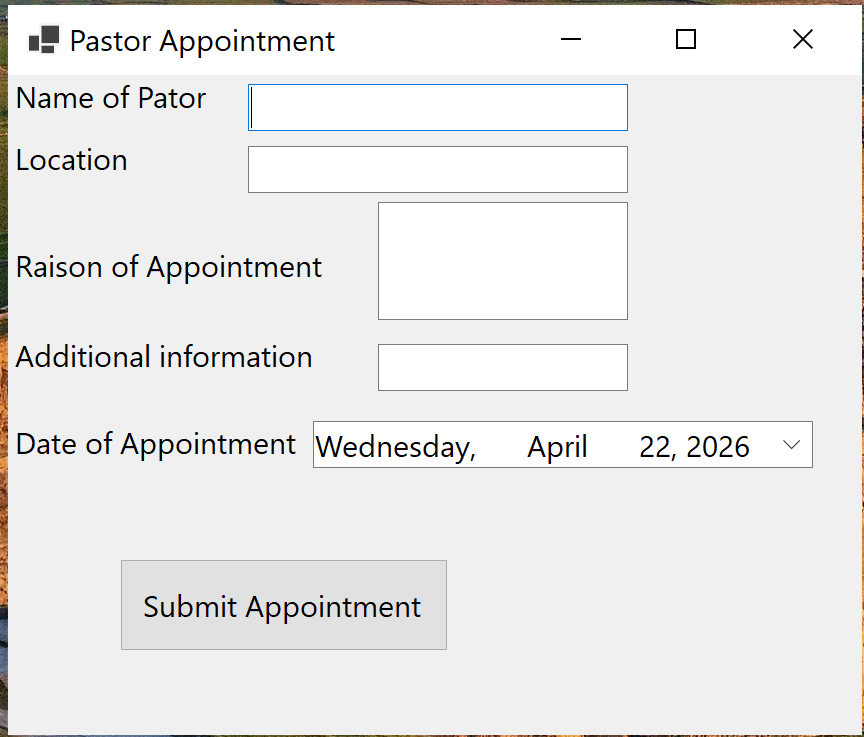

# PastorAppointment

Simple Windows Forms App (.NET 10) for creating and submitting pastor appointment records.

## Description

This is a minimal Windows Forms application that captures basic information for pastor appointments and allows the user to submit a record.

## Features

- Enter pastor name
- Enter location
- Enter reason for appointment
- Enter additional information
- Choose date of appointment
- Submit appointment button

## Fields

- Name of pastor
- Location
- Reason for appointment
- Additional information
- Date of appointment
- Submit appointment

## Screenshot

Place a screenshot of the form at `docs/docs/pastorProgramForm.png` and include it in the README like this:

Adjust the path if your screenshot is stored elsewhere.

## Usage

1. Fill in the form fields (Name, Location, Reason, Additional information, Date).
2. Click "Submit appointment" to save/submit the record.

